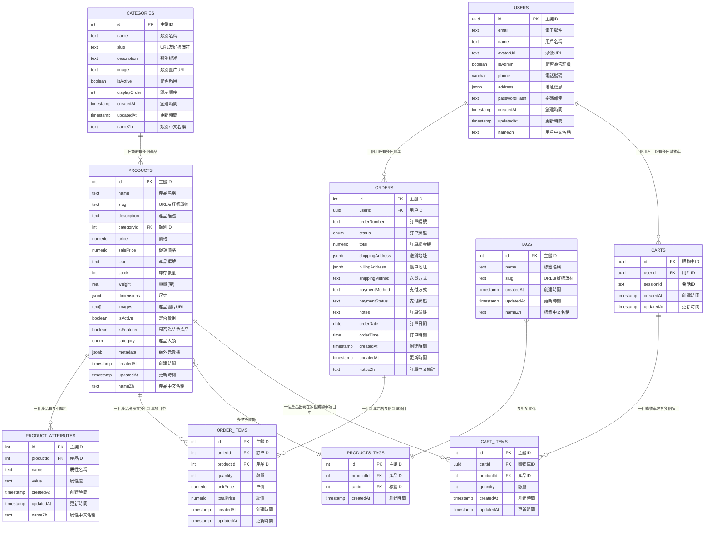

```mermaid
erDiagram
    CATEGORIES {
        int id PK "主鍵ID"
        text name "類別名稱"
        text slug "URL友好標識符"
        text description "類別描述"
        text image "類別圖片URL"
        boolean isActive "是否啟用"
        int displayOrder "顯示順序"
        timestamp createdAt "創建時間"
        timestamp updatedAt "更新時間"
        text nameZh "類別中文名稱"
    }
    
    PRODUCTS {
        int id PK "主鍵ID"
        text name "產品名稱"
        text slug "URL友好標識符"
        text description "產品描述"
        int categoryId FK "類別ID"
        numeric price "價格"
        numeric salePrice "促銷價格"
        text sku "產品編號"
        int stock "庫存數量"
        real weight "重量(克)"
        jsonb dimensions "尺寸"
        text[] images "產品圖片URL"
        boolean isActive "是否啟用"
        boolean isFeatured "是否為特色產品"
        enum category "產品大類"
        jsonb metadata "額外元數據"
        timestamp createdAt "創建時間"
        timestamp updatedAt "更新時間"
        text nameZh "產品中文名稱"
    }
    
    PRODUCT_ATTRIBUTES {
        int id PK "主鍵ID"
        int productId FK "產品ID"
        text name "屬性名稱"
        text value "屬性值"
        timestamp createdAt "創建時間"
        timestamp updatedAt "更新時間"
        text nameZh "屬性中文名稱"
    }
    
    USERS {
        uuid id PK "主鍵ID"
        text email "電子郵件"
        text name "用戶名稱"
        text avatarUrl "頭像URL"
        boolean isAdmin "是否為管理員"
        varchar phone "電話號碼"
        jsonb address "地址信息"
        text passwordHash "密碼雜湊"
        timestamp createdAt "創建時間"
        timestamp updatedAt "更新時間"
        text nameZh "用戶中文名稱"
    }
    
    ORDERS {
        int id PK "主鍵ID"
        uuid userId FK "用戶ID"
        text orderNumber "訂單編號"
        enum status "訂單狀態"
        numeric total "訂單總金額"
        jsonb shippingAddress "送貨地址"
        jsonb billingAddress "帳單地址"
        text shippingMethod "送貨方式"
        text paymentMethod "支付方式"
        text paymentStatus "支付狀態"
        text notes "訂單備註"
        date orderDate "訂單日期"
        time orderTime "訂單時間"
        timestamp createdAt "創建時間"
        timestamp updatedAt "更新時間"
        text notesZh "訂單中文備註"
    }
    
    ORDER_ITEMS {
        int id PK "主鍵ID"
        int orderId FK "訂單ID"
        int productId FK "產品ID"
        int quantity "數量"
        numeric unitPrice "單價"
        numeric totalPrice "總價"
        timestamp createdAt "創建時間"
        timestamp updatedAt "更新時間"
    }
    
    TAGS {
        int id PK "主鍵ID"
        text name "標籤名稱"
        text slug "URL友好標識符"
        timestamp createdAt "創建時間"
        timestamp updatedAt "更新時間"
        text nameZh "標籤中文名稱"
    }
    
    PRODUCTS_TAGS {
        int id PK "主鍵ID"
        int productId FK "產品ID"
        int tagId FK "標籤ID"
        timestamp createdAt "創建時間"
    }
    
    CARTS {
        uuid id PK "購物車ID"
        uuid userId FK "用戶ID"
        text sessionId "會話ID"
        timestamp createdAt "創建時間"
        timestamp updatedAt "更新時間"
    }
    
    CART_ITEMS {
        int id PK "主鍵ID"
        uuid cartId FK "購物車ID"
        int productId FK "產品ID"
        int quantity "數量"
        timestamp createdAt "創建時間"
        timestamp updatedAt "更新時間"
    }
    
    CATEGORIES ||--o{ PRODUCTS : "一個類別有多個產品"
    PRODUCTS ||--o{ PRODUCT_ATTRIBUTES : "一個產品有多個屬性"
    PRODUCTS ||--o{ ORDER_ITEMS : "一個產品出現在多個訂單項目中"
    USERS ||--o{ ORDERS : "一個用戶有多個訂單"
    ORDERS ||--o{ ORDER_ITEMS : "一個訂單包含多個訂單項目"
    PRODUCTS }|--|| PRODUCTS_TAGS : "多對多關係"
    TAGS }|--|| PRODUCTS_TAGS : "多對多關係"
    USERS ||--o{ CARTS : "一個用戶可以有多個購物車"
    CARTS ||--o{ CART_ITEMS : "一個購物車包含多個項目"
    PRODUCTS ||--o{ CART_ITEMS : "一個產品出現在多個購物車項目中"
```