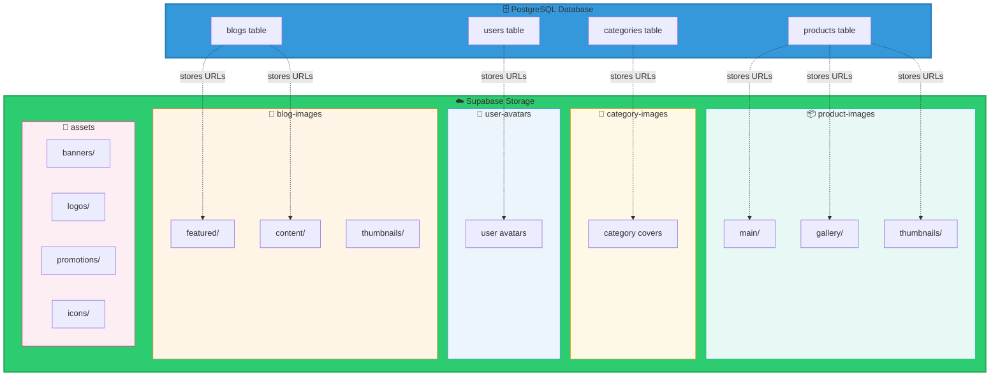

# 永安茶園 - 數據庫架構文檔

## 概述
本文檔描述了永安茶園電商網站的完整數據庫架構，包括 PostgreSQL 數據表和 Supabase Storage Buckets。

---

## 📊 數據庫表結構 (Database Tables)

### 1. categories（茶品類別表）
存儲茶品的不同類別信息。

| 欄位名稱 | 類型 | 說明 | 約束 |
|---------|------|------|------|
| id | serial | 主鍵ID | PRIMARY KEY |
| name | text | 類別名稱（英文） | NOT NULL |
| name_zh | text | 類別名稱（中文） | - |
| slug | text | URL友好標識符 | NOT NULL, UNIQUE |
| description | text | 類別描述 | - |
| image | text | 類別圖片URL | - |
| is_active | boolean | 是否啟用 | DEFAULT true |
| display_order | integer | 顯示順序 | DEFAULT 0 |
| created_at | timestamp | 創建時間 | NOT NULL |
| updated_at | timestamp | 更新時間 | NOT NULL |

**關聯關係：**
- 一對多：一個類別可以有多個產品

---

### 2. products（產品表）
存儲所有茶品及相關商品信息。

| 欄位名稱 | 類型 | 說明 | 約束 |
|---------|------|------|------|
| id | serial | 主鍵ID | PRIMARY KEY |
| name | text | 產品名稱（英文） | NOT NULL |
| name_zh | text | 產品名稱（中文） | - |
| slug | text | URL友好標識符 | NOT NULL, UNIQUE |
| description | text | 產品描述 | - |
| category_id | integer | 類別ID | FOREIGN KEY → categories.id |
| price | numeric(10,2) | 價格 | NOT NULL |
| sale_price | numeric(10,2) | 促銷價格 | - |
| sku | text | 庫存單位編號 | NOT NULL |
| stock | integer | 庫存數量 | DEFAULT 0 |
| weight | real | 重量（克） | - |
| dimensions | jsonb | 尺寸信息 | - |
| images | text[] | 產品圖片URL數組 | - |
| is_active | boolean | 是否啟用 | DEFAULT true |
| is_featured | boolean | 是否為特色產品 | DEFAULT false |
| category | product_category_enum | 產品大類 | ENUM('tea', 'accessory', 'gift') |
| metadata | jsonb | 額外元數據 | - |
| created_at | timestamp | 創建時間 | NOT NULL |
| updated_at | timestamp | 更新時間 | NOT NULL |

**關聯關係：**
- 多對一：多個產品屬於一個類別
- 一對多：一個產品可以有多個屬性
- 一對多：一個產品可以出現在多個訂單項目中
- 多對多：產品與標籤的多對多關係（通過 products_tags）

---

### 3. product_attributes（產品屬性表）
存儲產品的附加屬性，如茶品的產地、發酵程度等。

| 欄位名稱 | 類型 | 說明 | 約束 |
|---------|------|------|------|
| id | serial | 主鍵ID | PRIMARY KEY |
| product_id | integer | 產品ID | NOT NULL, FOREIGN KEY → products.id |
| name | text | 屬性名稱（英文） | NOT NULL |
| name_zh | text | 屬性名稱（中文） | - |
| value | text | 屬性值 | NOT NULL |
| created_at | timestamp | 創建時間 | NOT NULL |
| updated_at | timestamp | 更新時間 | NOT NULL |

**關聯關係：**
- 多對一：多個屬性屬於一個產品

---

### 4. users（用戶表）
存儲註冊用戶信息。

| 欄位名稱 | 類型 | 說明 | 約束 |
|---------|------|------|------|
| id | uuid | 用戶ID | PRIMARY KEY, DEFAULT random |
| email | text | 電子郵件 | NOT NULL, UNIQUE |
| name | text | 用戶名稱（英文） | - |
| name_zh | text | 用戶名稱（中文） | - |
| avatar_url | text | 頭像URL | - |
| is_admin | boolean | 是否為管理員 | DEFAULT false |
| phone | varchar(20) | 電話號碼 | - |
| address | jsonb | 地址信息 | - |
| password_hash | text | 密碼雜湊 | - |
| created_at | timestamp | 創建時間 | NOT NULL |
| updated_at | timestamp | 更新時間 | NOT NULL |

**關聯關係：**
- 一對多：一個用戶可以有多個訂單
- 一對多：一個用戶可以有多個購物車

---

### 5. orders（訂單表）
存儲用戶的訂單信息。

| 欄位名稱 | 類型 | 說明 | 約束 |
|---------|------|------|------|
| id | serial | 主鍵ID | PRIMARY KEY |
| user_id | uuid | 用戶ID | NOT NULL, FOREIGN KEY → users.id |
| order_number | text | 訂單編號 | NOT NULL, UNIQUE |
| status | order_status_enum | 訂單狀態 | DEFAULT 'pending' |
| total | numeric(10,2) | 訂單總金額 | NOT NULL |
| shipping_address | jsonb | 送貨地址 | NOT NULL |
| billing_address | jsonb | 帳單地址 | - |
| shipping_method | text | 送貨方式 | NOT NULL |
| payment_method | text | 支付方式 | NOT NULL |
| payment_status | text | 支付狀態 | DEFAULT 'pending' |
| notes | text | 訂單備註 | - |
| notes_zh | text | 訂單備註（中文） | - |
| order_date | date | 訂單日期 | NOT NULL |
| order_time | time | 訂單時間 | NOT NULL |
| created_at | timestamp | 創建時間 | NOT NULL |
| updated_at | timestamp | 更新時間 | NOT NULL |

**枚舉值 (order_status_enum)：** `pending`, `processing`, `shipped`, `delivered`, `cancelled`

**關聯關係：**
- 多對一：多個訂單屬於一個用戶
- 一對多：一個訂單包含多個訂單項目

---

### 6. order_items（訂單項目表）
存儲訂單中的每個產品項目。

| 欄位名稱 | 類型 | 說明 | 約束 |
|---------|------|------|------|
| id | serial | 主鍵ID | PRIMARY KEY |
| order_id | integer | 訂單ID | NOT NULL, FOREIGN KEY → orders.id |
| product_id | integer | 產品ID | NOT NULL, FOREIGN KEY → products.id |
| quantity | integer | 數量 | NOT NULL, DEFAULT 1 |
| unit_price | numeric(10,2) | 單價 | NOT NULL |
| total_price | numeric(10,2) | 總價 | NOT NULL |
| created_at | timestamp | 創建時間 | NOT NULL |
| updated_at | timestamp | 更新時間 | NOT NULL |

**關聯關係：**
- 多對一：多個訂單項目屬於一個訂單
- 多對一：訂單項目關聯到一個產品

---

### 7. tags（標籤表）
用於產品分類和搜索。

| 欄位名稱 | 類型 | 說明 | 約束 |
|---------|------|------|------|
| id | serial | 主鍵ID | PRIMARY KEY |
| name | text | 標籤名稱（英文） | NOT NULL, UNIQUE |
| name_zh | text | 標籤名稱（中文） | - |
| slug | text | URL友好標識符 | NOT NULL, UNIQUE |
| created_at | timestamp | 創建時間 | NOT NULL |
| updated_at | timestamp | 更新時間 | NOT NULL |

**關聯關係：**
- 多對多：標籤與產品的多對多關係（通過 products_tags）

---

### 8. products_tags（產品標籤關聯表）
實現產品與標籤的多對多關係。

| 欄位名稱 | 類型 | 說明 | 約束 |
|---------|------|------|------|
| id | serial | 主鍵ID | PRIMARY KEY |
| product_id | integer | 產品ID | NOT NULL, FOREIGN KEY → products.id |
| tag_id | integer | 標籤ID | NOT NULL, FOREIGN KEY → tags.id |
| created_at | timestamp | 創建時間 | NOT NULL |

---

### 9. carts（購物車表）
存儲用戶的購物車信息。

| 欄位名稱 | 類型 | 說明 | 約束 |
|---------|------|------|------|
| id | uuid | 購物車ID | PRIMARY KEY, DEFAULT random |
| user_id | uuid | 用戶ID | FOREIGN KEY → users.id |
| session_id | text | 會話ID（未登錄用戶） | - |
| created_at | timestamp | 創建時間 | NOT NULL |
| updated_at | timestamp | 更新時間 | NOT NULL |

**關聯關係：**
- 多對一：購物車屬於一個用戶
- 一對多：一個購物車包含多個購物車項目

---

### 10. cart_items（購物車項目表）
存儲購物車中的產品項目。

| 欄位名稱 | 類型 | 說明 | 約束 |
|---------|------|------|------|
| id | serial | 主鍵ID | PRIMARY KEY |
| cart_id | uuid | 購物車ID | NOT NULL, FOREIGN KEY → carts.id |
| product_id | integer | 產品ID | NOT NULL, FOREIGN KEY → products.id |
| quantity | integer | 數量 | NOT NULL, DEFAULT 1 |
| created_at | timestamp | 創建時間 | NOT NULL |
| updated_at | timestamp | 更新時間 | NOT NULL |

**關聯關係：**
- 多對一：多個購物車項目屬於一個購物車
- 多對一：購物車項目關聯到一個產品

---

## 💾 Supabase Storage Buckets

### 1. product-images（產品圖片）
**用途：** 存儲所有茶品和商品的圖片

**目錄結構：**
```
product-images/
├── main/              # 產品主圖
│   ├── {product_id}/
│   │   └── {image_name}.jpg
├── gallery/           # 產品畫廊圖片
│   ├── {product_id}/
│   │   └── {image_name}.jpg
└── thumbnails/        # 縮略圖
    ├── {product_id}/
    │   └── {image_name}.jpg
```

**訪問權限建議：**
- 公開讀取
- 僅管理員上傳/刪除

**文件類型：** JPG, PNG, WebP
**大小限制：** 5MB/文件

---

### 2. category-images（分類圖片）
**用途：** 存儲茶品類別的封面圖片

**目錄結構：**
```
category-images/
├── {category_id}/
│   └── cover.jpg
```

**訪問權限建議：**
- 公開讀取
- 僅管理員上傳/刪除

**文件類型：** JPG, PNG, WebP
**大小限制：** 3MB/文件

---

### 3. user-avatars（用戶頭像）
**用途：** 存儲用戶上傳的頭像圖片

**目錄結構：**
```
user-avatars/
├── {user_id}/
│   └── avatar.jpg
```

**訪問權限建議：**
- 公開讀取
- 用戶只能上傳/更新自己的頭像

**文件類型：** JPG, PNG
**大小限制：** 2MB/文件

---

### 4. blog-images（博客圖片）
**用途：** 存儲博客文章的配圖

**目錄結構：**
```
blog-images/
├── {blog_slug}/
│   ├── featured.jpg    # 特色圖片
│   ├── content/        # 文章內容圖片
│   │   └── {image_name}.jpg
│   └── thumbnails/     # 縮略圖
│       └── {image_name}.jpg
```

**訪問權限建議：**
- 公開讀取
- 僅管理員/編輯上傳/刪除

**文件類型：** JPG, PNG, WebP
**大小限制：** 5MB/文件

---

### 5. assets（公共資源）
**用途：** 存儲網站的公共資源（橫幅、Logo、促銷圖等）

**目錄結構：**
```
assets/
├── banners/           # 橫幅圖片
│   └── {banner_name}.jpg
├── logos/             # 網站Logo
│   └── {logo_variant}.svg
├── promotions/        # 促銷圖片
│   └── {promo_name}.jpg
└── icons/             # 圖標
    └── {icon_name}.svg
```

**訪問權限建議：**
- 公開讀取
- 僅管理員上傳/刪除

**文件類型：** JPG, PNG, WebP, SVG
**大小限制：** 10MB/文件

---

## 🔗 Mermaid ER 圖

### 數據庫關係圖

```mermaid
erDiagram
    %% 主è¦å¯¦é«”表
    CATEGORIES {
        serial id PK
        text name
        text name_zh
        text slug UK
        text description
        text image
        boolean is_active
        integer display_order
        timestamp created_at
        timestamp updated_at
    }

    PRODUCTS {
        serial id PK
        text name
        text name_zh
        text slug UK
        text description
        integer category_id FK
        numeric price
        numeric sale_price
        text sku
        integer stock
        real weight
        jsonb dimensions
        text_array images
        boolean is_active
        boolean is_featured
        product_category_enum category
        jsonb metadata
        timestamp created_at
        timestamp updated_at
    }

    PRODUCT_ATTRIBUTES {
        serial id PK
        integer product_id FK
        text name
        text name_zh
        text value
        timestamp created_at
        timestamp updated_at
    }

    USERS {
        uuid id PK
        text email UK
        text name
        text name_zh
        text avatar_url
        boolean is_admin
        varchar phone
        jsonb address
        text password_hash
        timestamp created_at
        timestamp updated_at
    }

    ORDERS {
        serial id PK
        uuid user_id FK
        text order_number UK
        order_status_enum status
        numeric total
        jsonb shipping_address
        jsonb billing_address
        text shipping_method
        text payment_method
        text payment_status
        text notes
        text notes_zh
        date order_date
        time order_time
        timestamp created_at
        timestamp updated_at
    }

    ORDER_ITEMS {
        serial id PK
        integer order_id FK
        integer product_id FK
        integer quantity
        numeric unit_price
        numeric total_price
        timestamp created_at
        timestamp updated_at
    }

    TAGS {
        serial id PK
        text name UK
        text name_zh
        text slug UK
        timestamp created_at
        timestamp updated_at
    }

    PRODUCTS_TAGS {
        serial id PK
        integer product_id FK
        integer tag_id FK
        timestamp created_at
    }

    CARTS {
        uuid id PK
        uuid user_id FK
        text session_id
        timestamp created_at
        timestamp updated_at
    }

    CART_ITEMS {
        serial id PK
        uuid cart_id FK
        integer product_id FK
        integer quantity
        timestamp created_at
        timestamp updated_at
    }

    %% 關係定義
    CATEGORIES ||--o{ PRODUCTS : "has many"
    PRODUCTS ||--o{ PRODUCT_ATTRIBUTES : "has many"
    PRODUCTS ||--o{ ORDER_ITEMS : "appears in"
    PRODUCTS ||--o{ CART_ITEMS : "in cart"
    PRODUCTS }o--o{ TAGS : "tagged with"
    PRODUCTS_TAGS }o--|| PRODUCTS : "links"
    PRODUCTS_TAGS }o--|| TAGS : "links"
    USERS ||--o{ ORDERS : "places"
    USERS ||--o{ CARTS : "owns"
    ORDERS ||--o{ ORDER_ITEMS : "contains"
    CARTS ||--o{ CART_ITEMS : "contains"
```



### Storage Buckets 架構圖



---

## 📝 建議的擴展表

### blogs（博客文章表）
目前代碼中有博客功能，但數據庫中未定義。建議添加：

```sql
CREATE TABLE blogs (
    id SERIAL PRIMARY KEY,
    slug TEXT NOT NULL UNIQUE,
    title TEXT NOT NULL,
    title_zh TEXT,
    content TEXT NOT NULL,
    excerpt TEXT,
    featured_image TEXT,
    author_id UUID REFERENCES users(id),
    category TEXT,
    tags TEXT[],
    is_published BOOLEAN DEFAULT false,
    published_at TIMESTAMP,
    created_at TIMESTAMP DEFAULT NOW() NOT NULL,
    updated_at TIMESTAMP DEFAULT NOW() NOT NULL
);
```

### reviews（產品評論表）
用於用戶對產品的評論和評分：

```sql
CREATE TABLE reviews (
    id SERIAL PRIMARY KEY,
    product_id INTEGER REFERENCES products(id) NOT NULL,
    user_id UUID REFERENCES users(id) NOT NULL,
    rating INTEGER CHECK (rating >= 1 AND rating <= 5) NOT NULL,
    title TEXT,
    comment TEXT,
    is_verified_purchase BOOLEAN DEFAULT false,
    is_approved BOOLEAN DEFAULT false,
    created_at TIMESTAMP DEFAULT NOW() NOT NULL,
    updated_at TIMESTAMP DEFAULT NOW() NOT NULL
);
```

### wishlist（願望清單表）
用戶收藏喜愛的產品：

```sql
CREATE TABLE wishlist (
    id SERIAL PRIMARY KEY,
    user_id UUID REFERENCES users(id) NOT NULL,
    product_id INTEGER REFERENCES products(id) NOT NULL,
    created_at TIMESTAMP DEFAULT NOW() NOT NULL,
    UNIQUE(user_id, product_id)
);
```

---

## 🔒 安全建議

### Row Level Security (RLS) 策略

#### 1. users 表
```sql
-- 用戶只能讀取和更新自己的資料
ALTER TABLE users ENABLE ROW LEVEL SECURITY;

CREATE POLICY "Users can view own data"
    ON users FOR SELECT
    USING (auth.uid() = id);

CREATE POLICY "Users can update own data"
    ON users FOR UPDATE
    USING (auth.uid() = id);
```

#### 2. orders 表
```sql
-- 用戶只能查看自己的訂單
ALTER TABLE orders ENABLE ROW LEVEL SECURITY;

CREATE POLICY "Users can view own orders"
    ON orders FOR SELECT
    USING (auth.uid() = user_id);
```

#### 3. carts 表
```sql
-- 用戶只能操作自己的購物車
ALTER TABLE carts ENABLE ROW LEVEL SECURITY;

CREATE POLICY "Users can manage own cart"
    ON carts FOR ALL
    USING (auth.uid() = user_id);
```

### Storage Bucket 安全策略

#### product-images
```sql
-- 公開讀取，僅管理員上傳
CREATE POLICY "Public read access"
    ON storage.objects FOR SELECT
    USING (bucket_id = 'product-images');

CREATE POLICY "Admin upload access"
    ON storage.objects FOR INSERT
    WITH CHECK (
        bucket_id = 'product-images'
        AND auth.jwt()->>'role' = 'admin'
    );
```

#### user-avatars
```sql
-- 用戶只能上傳自己的頭像
CREATE POLICY "Users can upload own avatar"
    ON storage.objects FOR INSERT
    WITH CHECK (
        bucket_id = 'user-avatars'
        AND (storage.foldername(name))[1] = auth.uid()::text
    );
```

---

## 📋 索引建議

為了優化查詢性能，建議添加以下索引：

```sql
-- Products 表
CREATE INDEX idx_products_category_id ON products(category_id);
CREATE INDEX idx_products_slug ON products(slug);
CREATE INDEX idx_products_is_active ON products(is_active);
CREATE INDEX idx_products_is_featured ON products(is_featured);

-- Orders 表
CREATE INDEX idx_orders_user_id ON orders(user_id);
CREATE INDEX idx_orders_status ON orders(status);
CREATE INDEX idx_orders_order_date ON orders(order_date DESC);

-- Order Items 表
CREATE INDEX idx_order_items_order_id ON order_items(order_id);
CREATE INDEX idx_order_items_product_id ON order_items(product_id);

-- Product Attributes 表
CREATE INDEX idx_product_attributes_product_id ON product_attributes(product_id);

-- Products Tags 表
CREATE INDEX idx_products_tags_product_id ON products_tags(product_id);
CREATE INDEX idx_products_tags_tag_id ON products_tags(tag_id);

-- Cart Items 表
CREATE INDEX idx_cart_items_cart_id ON cart_items(cart_id);
CREATE INDEX idx_cart_items_product_id ON cart_items(product_id);
```

---

## 🚀 部署檢查清單

### 數據庫設置
- [ ] 創建所有必要的表
- [ ] 設置適當的索引
- [ ] 配置 Row Level Security 策略
- [ ] 設置數據庫備份策略
- [ ] 配置連接池設置

### Storage 設置
- [ ] 創建所有必要的 Buckets
- [ ] 配置 Bucket 訪問策略
- [ ] 設置文件大小限制
- [ ] 配置允許的文件類型
- [ ] 設置 CDN 緩存策略

### 安全設置
- [ ] 啟用 SSL/TLS 連接
- [ ] 配置環境變量（不要硬編碼敏感信息）
- [ ] 設置適當的 CORS 策略
- [ ] 配置 API 速率限制
- [ ] 啟用日誌監控

---

## 📞 相關文檔鏈接

- [Supabase 官方文檔](https://supabase.com/docs)
- [Drizzle ORM 文檔](https://orm.drizzle.team/)
- [PostgreSQL 文檔](https://www.postgresql.org/docs/)
- [Row Level Security 指南](https://supabase.com/docs/guides/auth/row-level-security)

---

**文檔版本：** 1.0
**最後更新：** 2025-12-08
**維護者：** 永安茶園開發團隊
